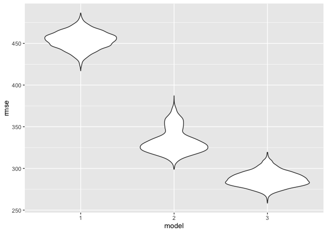

Homework 6
================
Diana Sanchez

This is my solution to HW1.

``` r
library(tidyverse)
```

    ## ── Attaching packages ─────────────────────────────────────── tidyverse 1.3.0 ──

    ## ✓ ggplot2 3.3.2     ✓ purrr   0.3.4
    ## ✓ tibble  3.0.3     ✓ dplyr   1.0.2
    ## ✓ tidyr   1.1.2     ✓ stringr 1.4.0
    ## ✓ readr   1.3.1     ✓ forcats 0.5.0

    ## ── Conflicts ────────────────────────────────────────── tidyverse_conflicts() ──
    ## x dplyr::filter() masks stats::filter()
    ## x dplyr::lag()    masks stats::lag()

``` r
library(readxl)
library(patchwork)
```

## Problem 2

Read the birthweight data set.

Propose a regression model for birthweight. This model may be based on a
hypothesized structure for the factors that underly birthweight, on a
data-driven model-building process, or a combination of the two.
Describe your modeling process and show a plot of model residuals
against fitted values – use add\_predictions and add\_residuals in
making this plot.

Compare your model to two others:

One using length at birth and gestational age as predictors (main
effects only) One using head circumference, length, sex, and all
interactions (including the three-way interaction) between these Make
this comparison in terms of the cross-validated prediction error; use
crossv\_mc and functions in purrr as appropriate.

Note that although we expect your model to be reasonable, model building
itself is not a main idea of the course and we don’t necessarily expect
your model to be “optimal”.

``` r
bw_df =
  read_csv(
    "./data/birthweight.csv") %>%
  drop_na() %>%
  mutate(
    babysex = as.factor(babysex),
    frace = as.factor(frace),
    mrace = as.factor(mrace),
    malform = as.factor(malform),
    mrace = as.factor(mrace))

model_1 = lm(bwt ~ smoken + malform, data = bw_df)

model_2 = lm(bwt ~ blength + gaweeks, data = bw_df)

model_3 = lm(bwt ~ bhead + blength + babysex + bhead * blength + bhead * babysex + blength * babysex + bhead * blength * babysex , data = bw_df)
```

## Problem 3

``` r
weather_df = 
  rnoaa::meteo_pull_monitors(
    c("USW00094728"),
    var = c("PRCP", "TMIN", "TMAX"), 
    date_min = "2017-01-01",
    date_max = "2017-12-31") %>%
  mutate(
    name = recode(id, USW00094728 = "CentralPark_NY"),
    tmin = tmin / 10,
    tmax = tmax / 10) %>%
  select(name, id, everything())

weath_3 = weather_df %>% 
  modelr::bootstrap(n = 10) %>% 
  mutate(
    models = map(strap, ~ lm(tmax ~ tmin, data = .x)),
    results = map(models, broom::glance),
    results2 = map(models, broom::tidy)) %>%
  select(results, results2) %>%
  unnest(results) %>%
  select(r.squared, results2) %>%
  unnest(results2) %>%
  select(r.squared, term, estimate) %>%
  pivot_wider(
  names_from = "term", 
  values_from = "estimate") %>%
    rename(
    beta_0 = `(Intercept)`,
    beta_1 = tmin) %>%
  mutate(
  log = log((beta_0 * beta_1)))
```

### Distribution plots for r̂2 and log(β̂0∗β

``` r
weath_graph1 =
  ggplot(data = weath_3, aes(x = r.squared)) + geom_density()

weath_graph2 =
  ggplot(data = weath_3, aes(x = log)) + geom_density()

weath_graph1 + weath_graph2
```

<!-- -->

EXPLAIN PLOTS\!\!\!\!\!

### 95% confidence interval for r̂2 and log(β̂0∗β̂)

``` r
r_2 = pull(weath_3, r.squared)
weath_r = quantile(r_2, c(0.025, 0.975))

log_2 = pull(weath_3, log)
weath_log = quantile(log_2, c(0.025, 0.975))

weath_r %>%
  knitr::kable(
  caption = "95% CI for r̂")
```

|       |         x |
| :---- | --------: |
| 2.5%  | 0.8814370 |
| 97.5% | 0.9286281 |

95% CI for r̂

``` r
weath_log %>%
  knitr::kable(
    caption = "95% CI for  log(β̂0∗β̂)"
  )
```

|       |        x |
| :---- | -------: |
| 2.5%  | 1.970002 |
| 97.5% | 2.054817 |

95% CI for log(β̂0∗β̂)
